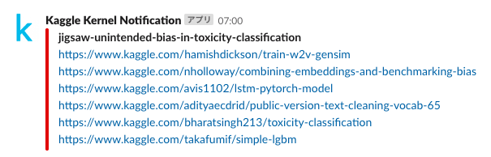

# Kaggle Kernel Notification

[](https://heroku.com/deploy)

Notify new posted kernel to Slack or LINE using Kaggle API and Heroku.

Please be careful about [this issue](https://github.com/Doarakko/kaggle-kernel-notification/issues/1).

## Requirements

- Kaggle API
- Heroku
- Credit card
  - It does not take money, to sign up and deploy heroku
- [Slack](https://api.slack.com/incoming-webhooks) or [LINE](https://notify-bot.line.me)

## Usage

### 1. Press button(`Deploy to Heroku`) and enter environment variables

You need to enter your credit card information to use [Heroku Scheduler](https://devcenter.heroku.com/articles/scheduler).  
Standard plan is free, so please don't worry.


Do not enter more than one in `COMPETITION_NAME`.  
If you participate in some competitions, please deploy for the number of competitions.

### 2. Set task on Heroku


Set `FREQUENCY` with `Daily`.


```
# assume to run once a day
pre_date = now - datetime.timedelta(days=1)

if last_run_date >= pre_date:
```

If you get at short intervals, the results will overlap.  
In that case, please fork and correct the program.

## Sample

- Slack



- LINE


## Contribution

Welcome issue and pull request.

For example, add other notification destination(Discord, Chatwork, etc).

## License

MIT

## Author

Doarakko
